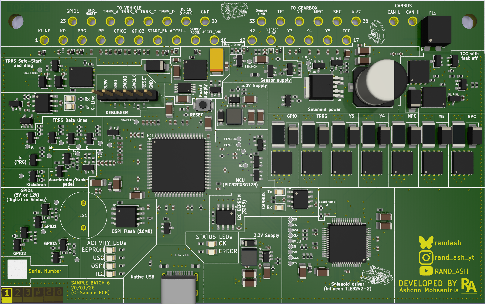

# Ultimate-NAG52 firmware V2

**VERY EARLY WORK IN PROGRESS**

Ultimate NAG52 V2 firmware (Written in 100% Rust!)

This is for the Alpha board gen 2.0 (Closing PCB testing), using Microchips PIC32CXSG41 series processor.

## What is this?

The next generation of the Ultimate-NAG52 PCB which improves on many things. The existing (older) 1.x ESP32 PCB firmware written in C++
can be found [here](https://github.com/rnd-ash/ultimate-nag52-fw)

Ultimate-NAG52 is a long-running project of mine, creating a much better controller for Mercedes' 722.6 5 speed automatic gearbox. The original controller's for this box were called EGS51, EGS52, and EGS53 (**Elektronische Getriebesteuerung 5-Gang V1/2/3**), where 51 was based on an SEC51C810 processor, and 52/53 are based on a C166/ST10 processor. 

## Development youtube videos
* [Bootloader and flashing demo](https://youtu.be/43IkJqjCc6U)
* [IO + Solenoids demonstration](https://youtu.be/8vf_0HNlVDg)

## Repository folders

|Folder|Description|
|:-:|:-:|
|bootloader|Bootloader of the TCU which supports flashing over KWP2000 over either USB or CAN|
|bsp|Board definition code (Pin assignments), and also some extra helper function for constructing peripherals|
|candb_codegen|A dependency of the firmware. This converts the CAN database text files into code at compile time for the firmware to use|
|firmware|The TCU application code|
|flasher|CLI flashing and diagnostics utility|
|macros|Helper proc-macros for the firmware|
|preloader|Preloader app which allows the bootloader to be self-updating|

## TCU Boot sequence

1. CPU jumps to [preloader](preloader/) on power on
    * If bootloader requires updating, the bootloader scratch area is verified, before being copied to the bootloader memory location.
2. Preloader does a quick RAM Test of MCAN RAM (As CAN is inactive)
3. Preloader jumps to the [bootloader](bootloader/)
    * Bootloader will **not** jump to the application if one of the following conditions is true:
        1. Magic pin is shorted (SDA + GND on the EEPROM chip)
        2. `stay-in-bootloader` compile flag is set
        3. Application flashing check failed
        4. The application has told the bootloader to launch (Enter reprogramming mode via diagnostics)
        5. Panic, or a hard/bus fault in the application was triggered.
        6. Watchdog in the application was triggered
        7. Application or Preloader RAM Test failed
    * The bootloader allows for updating itself and the application via KWP2000 protocol, over CAN or USB
3. Bootloader jumps to the [application](firmware/)

### Time to boot

This is taken for a nominal boot (No regions are to be flashed). [Comparison YT short comparing V1.3 PCB bootup to OEM EGS52 to this bootloader](https://youtube.com/shorts/wH1RuCAuE14)

|Timestamp||
|:-:|:-:|
|0ms|Power on|
|0.5ms|Preloader start|
|2.7ms|Bootloader start|
|2.72ms|Bootloader verify app|
|3ms|Application start|

## Memory map

### Flash (1MB)

|Start address|End address|Size|Usage|
|:-:|:-:|:-:|:-:|
|0x00000000|0x00001FFF|8KB|Preloader|
|0x00002000|0x0001DFFF|112KB|Bootloader|
|0x00018000|0x00100000|896KB|Application/Bootloader scratch [^1]|

[^1]:- Bootloader update will write into application space, destroying it, as the application has to be updated after updating the bootloader.

---

### RAM (256KB)

|Start address|End address|Size|Usage|
|:-:|:-:|:-:|:-:|
|0x20000000|0x2000FFFF|2KB|MCAN CAN0 Buffer|
|0x20010000|0x200103FF|512|Bootloader<->Application communication|
|0x20010000|0x200103FF|128|RAM Test scratch buffer|
|0x20010400|0x20040000|191KB|RAM
